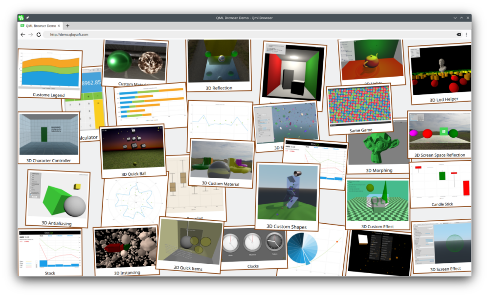

# Demo Collection for QmlBrowser

QmlBrowser is full-featured Chromium based open-source web browser with QML pages support.

QmlBrowser: https://github.com/Toorion/qml-browser

Demo: http://demo.qbqsoft.com

